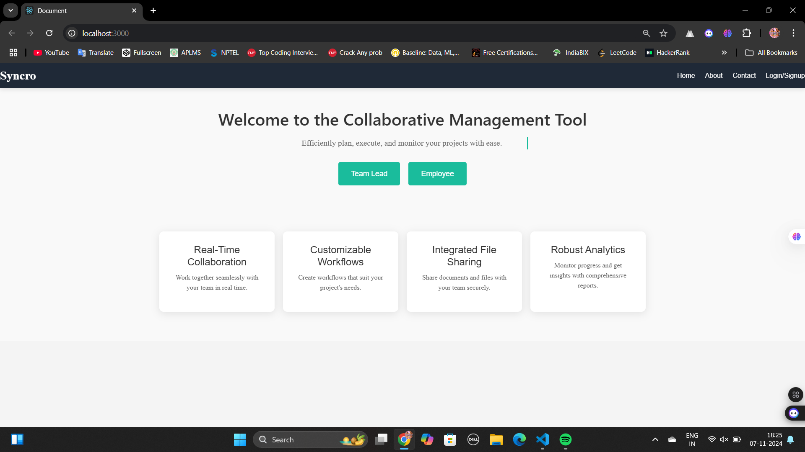
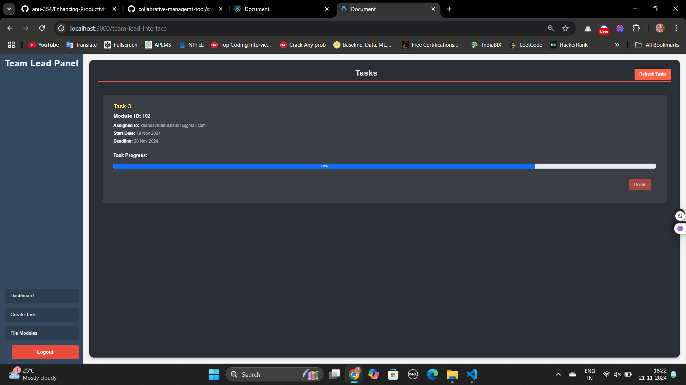
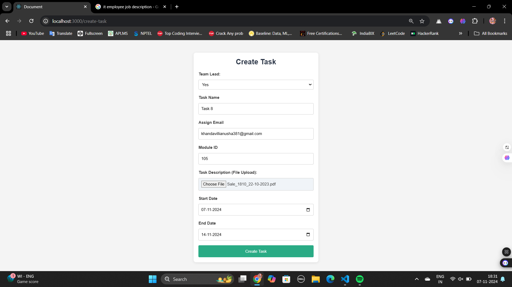
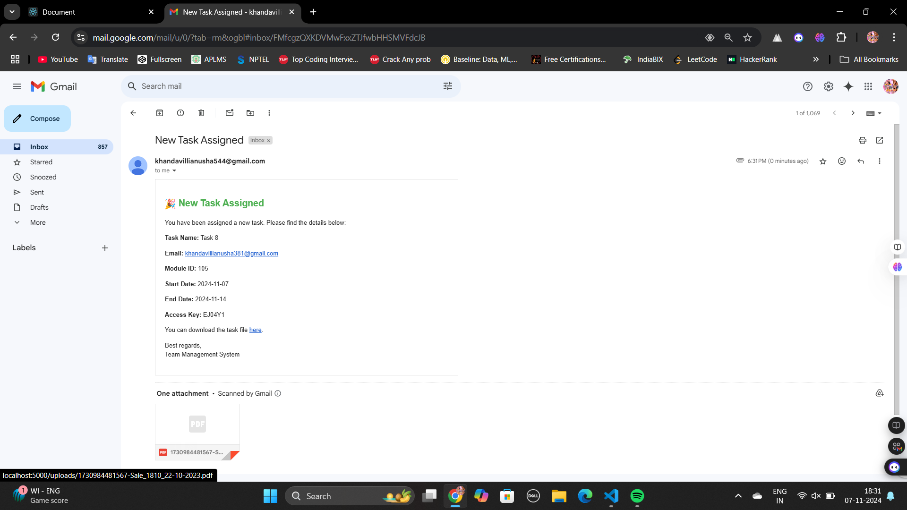
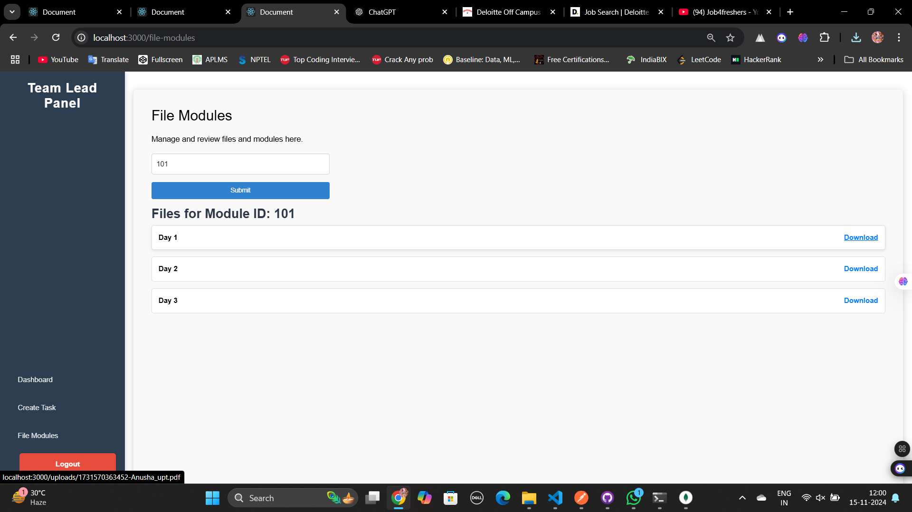
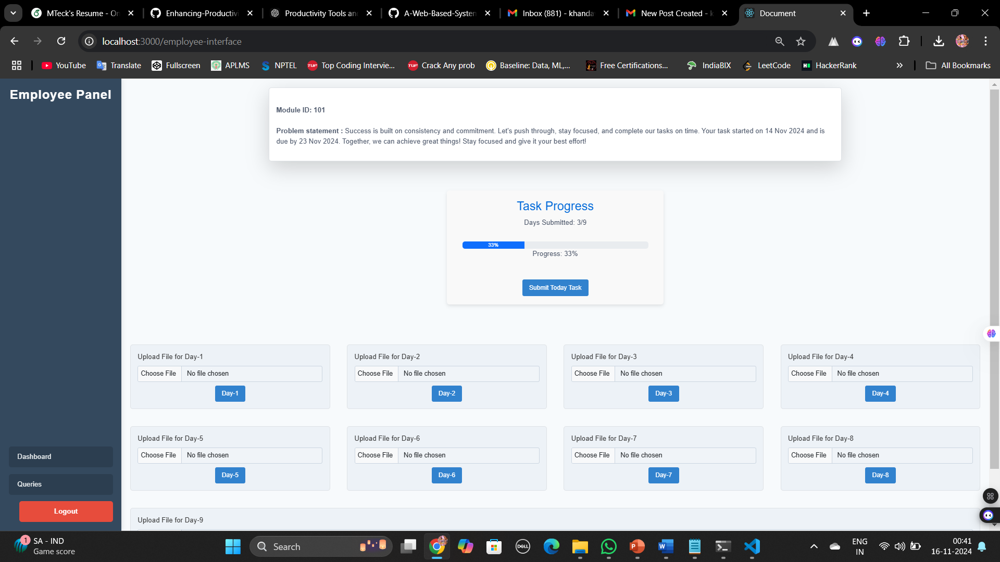
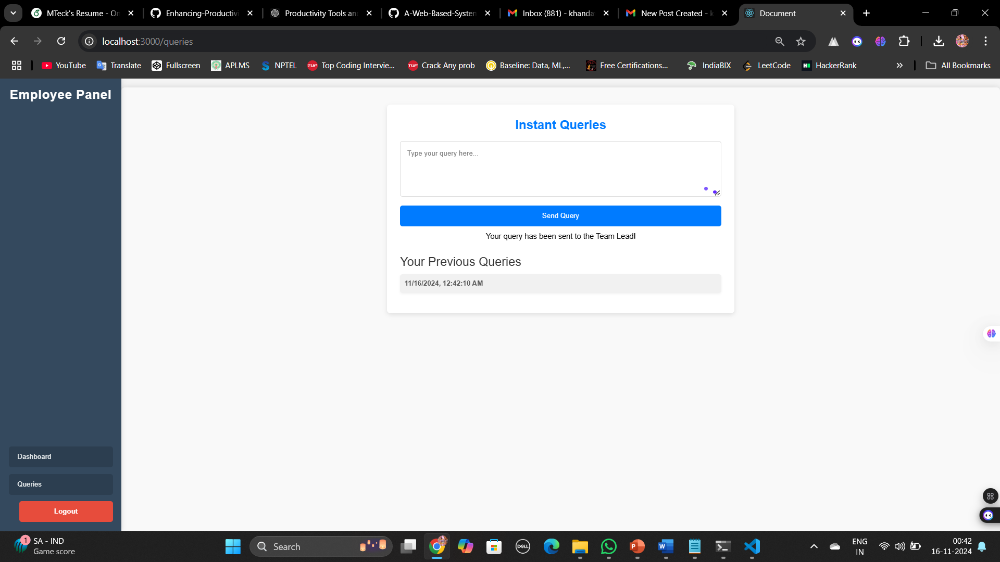

# Getting Started with Create React App

This project was bootstrapped with [Create React App](https://github.com/facebook/create-react-app).

## Available Scripts

In the project directory, you can run:

### `npm start`

Runs the app in the development mode.\
Open [http://localhost:3000](http://localhost:3000) to view it in your browser.

The page will reload when you make changes.\
You may also see any lint errors in the console.

### `npm test`

Launches the test runner in the interactive watch mode.\
See the section about [running tests](https://facebook.github.io/create-react-app/docs/running-tests) for more information.

### `npm run build`

Builds the app for production to the `build` folder.\
It correctly bundles React in production mode and optimizes the build for the best performance.

The build is minified and the filenames include the hashes.\
Your app is ready to be deployed!

See the section about [deployment](https://facebook.github.io/create-react-app/docs/deployment) for more information.

### `npm run eject`

**Note: this is a one-way operation. Once you `eject`, you can't go back!**

If you aren't satisfied with the build tool and configuration choices, you can `eject` at any time. This command will remove the single build dependency from your project.

Instead, it will copy all the configuration files and the transitive dependencies (webpack, Babel, ESLint, etc) right into your project so you have full control over them. All of the commands except `eject` will still work, but they will point to the copied scripts so you can tweak them. At this point you're on your own.

You don't have to ever use `eject`. The curated feature set is suitable for small and middle deployments, and you shouldn't feel obligated to use this feature. However we understand that this tool wouldn't be useful if you couldn't customize it when you are ready for it.

## Enhancing Productivity Through Advanced Tools for Collaborative Efficiency and Real-Time Monitoring

The **Enhancing Productivity Through Advanced Tools for Collaborative Efficiency and Real-Time Monitoring** is an innovative online platform designed to improve team collaboration, productivity, and project management. It enables users to easily manage tasks, track progress, and communicate in real time, ensuring a seamless workflow for teams of all sizes.

## Key Features

- **Task Management**: Create, assign, and track tasks efficiently. Users can set deadlines, prioritize tasks, and monitor progress with ease.
- **Real-Time Communication**: Stay connected with team members using built-in chat, notifications, and real-time updates.
- **Collaboration Tools**: Share files, comment on tasks, and collaborate on projects directly within the platform.
- **Data Integration**: Integrates with popular tools like Google Drive, Dropbox, and Slack for enhanced team productivity.
- **User Roles**: Assign roles and permissions to manage team access and ensure smooth coordination.
- **Project Tracking**: Visualize project timelines, milestones, and deadlines with interactive Gantt charts.
  
## Future Developments

The platform is continuously evolving, with several upcoming features aimed at improving performance and functionality:

1. **Advanced Data Analysis**: Enhanced analytics to track team performance, identify bottlenecks, and optimize resource allocation.
2. **Gamification**: Adding elements like badges, rewards, and leaderboards to make task completion more engaging and fun for users.
3. **Sensor Integration**: Integrating IoT sensors to monitor real-time project metrics (e.g., resource usage, environmental data) to facilitate better decision-making.
4. **Emergency Decision-Making Tools**: Develop features to help teams respond more effectively to urgent situations, such as critical project issues or emergencies.
5. **Global Expansion**: The platform will be expanded to various industries and regions, encouraging collaboration on a global scale to solve challenges efficiently.

## How to Use

1. **Sign Up / Log In**: Create an account or log in to your existing one.
2. **Create a New Project**: Start by creating a new project, and invite team members to join.
3. **Assign Tasks**: Add tasks to the project, assign them to team members, and set due dates.
4. **Collaborate**: Use the chat feature to communicate and share updates, documents, and feedback with the team.
5. **Monitor Progress**: View project status and timelines using the dashboard or Gantt charts.

## Technologies Used

- **Frontend**: HTML5, CSS3, JavaScript (React.js)
- **Backend**: Node.js, Express.js
- **Database**: MongoDB
- **Authentication**: JWT (JSON Web Tokens)

## Screenshots:

Home page:

TeamLead Panel:

Creating Task:

Task Assign Mail:

File Modules:

Employee Panel:

Queries:

## Conclusion:

The Enhancing Productivity Through Advanced Tools for Collaborative Efficiency and Real-Time Monitoring aims to revolutionize how teams work together by providing a comprehensive platform for task management, real-time communication, and seamless collaboration. With continuous improvements and future enhancements such as advanced data analysis, gamification, and global expansion, this tool has the potential to transform team productivity and efficiency.

By integrating cutting-edge technologies and fostering innovation, we envision this platform as a key driver in optimizing workflows, enhancing decision-making, and promoting global collaboration. We invite developers, organizations, and users alike to join us in shaping the future of team collaboration and project management.

